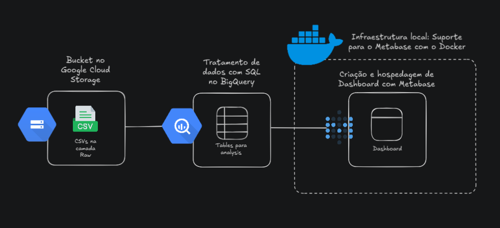
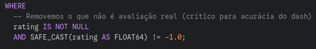
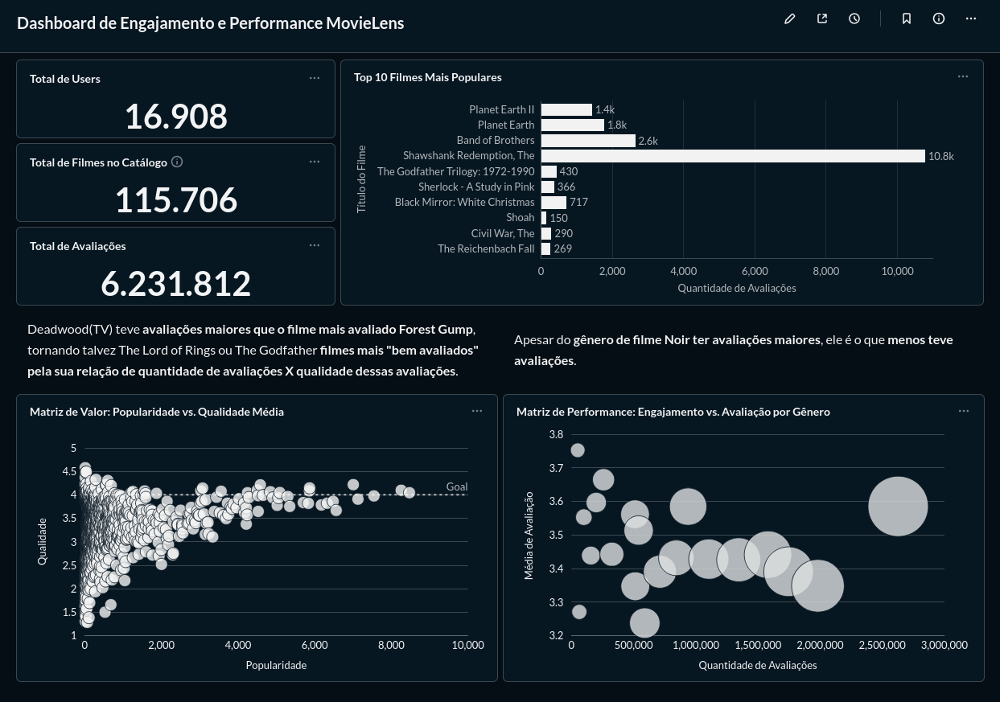
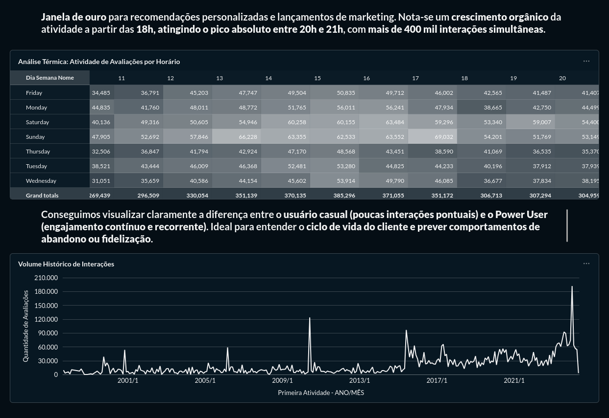
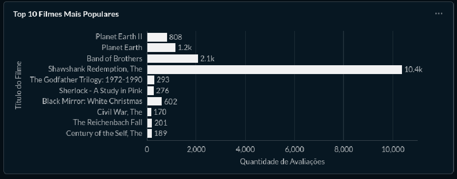
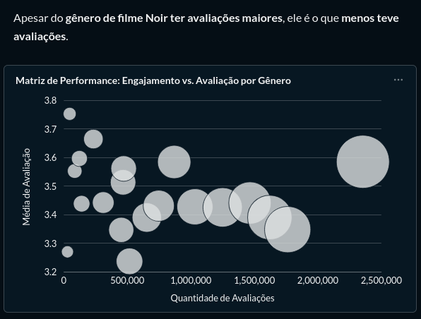
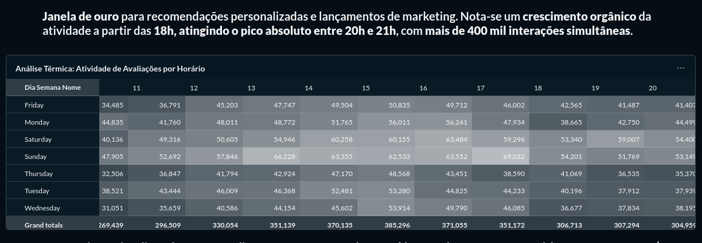

# MovieLens Data Architecture: End-to-End Analytics Pipeline

Este projeto apresenta a implementação de uma arquitetura de dados moderna (Modern Data Stack) para o processamento e análise de um volume superior a **6,2 milhões de registros** provenientes do dataset MovieLens[cite: 14]. A solução abrange desde a ingestão em nuvem até a entrega de dashboards estratégicos, utilizando uma estrutura de camadas para garantir a integridade e a performance das consultas.

## 🎯 Objetivo
Desenvolver uma infraestrutura escalável que transforme dados brutos de interações cinematográficas em insights sobre comportamento do usuário, performance de catálogo e janelas de engajamento.



## 🛠️ Stack Técnica
* **Armazenamento:** Google Cloud Storage (GCS).
* **Data Warehouse:** Google BigQuery.
* **Transformação de Dados:** SQL (BigQuery Dialect).
* **Visualização:** Metabase (Containerizado via Docker).
* **Arquitetura:** Medallion (Bronze, Silver e Gold).

## 📂 Estrutura do Repositório

```
movielens-data-architecture/
├── infrastructure/
│   └── docker-compose.yml       # Configuração do Metabase via Docker
├── data_modeling/
│   ├── bronze/                  # Scripts de carga inicial e DDL de tabelas externas
│   ├── silver/                  # Queries de limpeza, casting e Regex
│   └── gold/                    # Camada semântica e Views de negócio
├── dashboard/
│   ├── queries_metabase.sql     # Mapeamento das consultas que alimentam o BI
│   ├── documentation.md         # Análise detalhada dos KPIs e Storytelling
│   └── screenshots/             # Registro visual do dashboard final
└── README.md                    # Documentação principal
```

## 🏗️ Arquitetura de Dados

O projeto segue o padrão **Medallion Architecture**, garantindo a linhagem e a qualidade dos dados em cada etapa:

1.  **Camada Bronze (Raw):** Ingestão dos arquivos CSV originais em tabelas externas no BigQuery, preservando o estado bruto dos dados armazenados no GCS.
2.  **Camada Silver (Cleaned):** Processamento e limpeza. Aplicação de `SAFE_CAST`, normalização de strings via Regex para extração de anos de lançamento e tratamento de valores nulos (`NULLIF`) para garantir a integridade estatística.
3.  **Camada Gold (Analytical):** Criação de camadas semânticas via Views. Esta camada foi projetada para otimizar o consumo por ferramentas de BI, consolidando KPIs como médias globais e performance por gênero.

## 📈 Insights e Resultados

A análise resultou em indicadores críticos para a compreensão do ecossistema de entretenimento:

* **Escala de Dados:** Monitoramento de 16.908 usuários únicos e 115.706 títulos catalogados[cite: 3, 12, 14].
* **Padrões Temporais:** Identificação de um pico de engajamento absoluto entre **20h e 21h**, com mais de 400 mil interações simultâneas[cite: 50].
* **Performance de Catálogo:** Distinção entre títulos de alta popularidade e alta qualidade (Ex: *Shawshank Redemption* com 10.8k avaliações)[cite: 17, 45].
* **Segmentação de Nicho:** O gênero *Noir* apresenta as maiores médias de avaliação, apesar do menor volume de interações[cite: 35].

## Reajuste na limpeza de avaliações -1.0

### Lógica de Limpeza de Dados (ETL)

As métricas do dashboard foram atualizadas para refletir apenas avaliações válidas. Registros com rating = -1 ou valores NULL foram removidos da camada de visualização para evitar distorções na média aritmética e na contagem total de interações.


O que mudou e por que:

Uso de CTE (WITH): Deixa o código mais limpo. Primeiro unimos tudo, depois aplicamos a lógica de limpeza uma única vez no final.

Filtro WHERE em vez de NULLIF: Agora, se um filme tem o rating -1.0, a linha inteira é ignorada. Isso evita que o seu Metabase diga que você tem "1 milhão de avaliações" quando, na verdade, 20% delas são lixo.

Segurança no Cast: Mantivemos o SAFE_CAST para garantir que se algum dado vier com texto onde deveria ser número, a query não quebre (ela apenas gera um NULL que o filtro limpa).


## 🖼️ Visualização (Dashboard)

Abaixo estão as representações visuais da camada Gold consumida pelo Metabase:




### 1. Visão Geral de Performance e Popularidade
>
*Análise de volume de interações vs. popularidade dos títulos.*

### 2. Matriz de Valor e Engajamento por Gênero
>
*Correlação entre a média de avaliação e a quantidade de interações por categoria.*

### 3. Análise Térmica (Heatmap)
>
*Mapeamento da "Janela de Ouro" para recomendações e marketing.*

## 🚀 Como Replicar este Projeto

### Pré-requisitos
* Conta no **Google Cloud Platform (GCP)** com projeto ativo.
* **Docker** e **Docker Compose** instalados localmente.
* SDK do Google Cloud (`gcloud`) configurado.

### Passo 1: Infraestrutura de Dados
1. Crie um Bucket no Google Cloud Storage e faça o upload dos arquivos `.csv` para uma pasta chamada `/bronze`.
2. No BigQuery, crie dois datasets: `movielens` (para a camada Bronze) e `movielens_analytics` (para Silver e Gold).
3. Execute os scripts SQL contidos em `data_modeling/bronze` para criar as tabelas externas apontando para o seu Bucket.

### Passo 2: Processamento (Silver & Gold)
1. Execute o script em `data_modeling/silver/transform_and_clean.sql` para gerar as tabelas persistentes de fatos e dimensões.
2. Execute o script em `data_modeling/gold/create_analytics_views.sql` para criar as views de consumo.

### Passo 3: Visualização (Metabase)

Para garantir que o Dashboard carregue corretamente com todas as perguntas e configurações salvas, siga os passos abaixo:

1. Permissões de Diretório: O Metabase no Docker utiliza um usuário interno (UID 2000). Ajuste a posse da pasta de backup para evitar erros de escrita:

```
Bash

sudo chown -R 2000:2000 ./infrastructure/backup_metabase
```

2. Inicialização do Container: No Fedora (ou sistemas com SELinux), é necessário utilizar o sufixo :Z no volume para permitir o acesso do Docker aos arquivos locais. 

Execute:

```
Bash

docker run -d -p 3000:3000 \
-v "$(pwd)/infrastructure/backup_metabase:/metabase-data:Z" \
-e "MB_DB_FILE=/metabase-data/metabase.db" \
--name metabase metabase/metabase
```

3. Acesso e Conexão: - Acesse http://localhost:3000.

- O dashboard e as perguntas devem carregar automaticamente a partir do backup.

- Caso precise reconectar, utilize sua chave JSON do GCP e aponte para as Views da camada Gold (movielens_analytics).